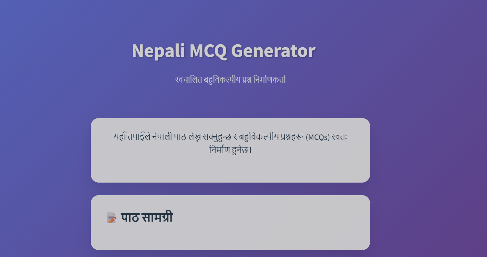
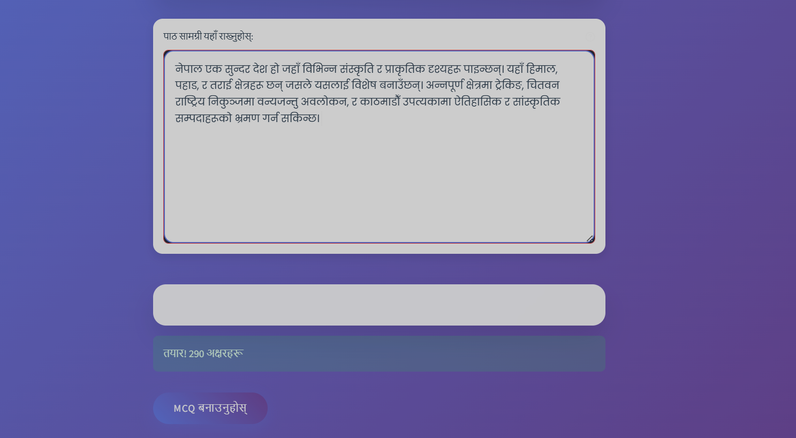
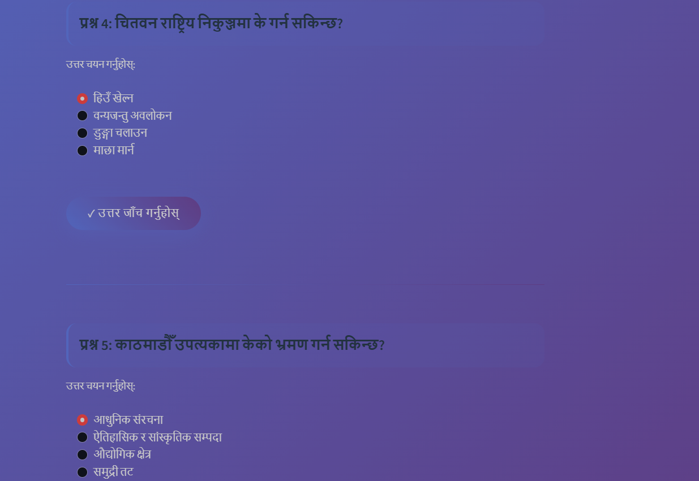

# Nepali MCQ Generator (Gemini 2.5 Powered)

> **Live Demo:** [nepalimcqgenerator.streamlit.app](https://nepalimcqgenerator.streamlit.app)

A modern web app to generate high-quality, context-aware Nepali multiple-choice questions (MCQs) from any input text using Google Gemini 2.5. No fallback or hardcoded content—every MCQ is based on your actual input!

---

##  Features

- **Real-time MCQ Generation:** Uses Gemini 2.5 for accurate, relevant questions
- **Supports Any Subject:** History, science, literature, etc.
- **Beautiful Streamlit UI:** Clean, mobile-friendly, and distraction-free
- **No Fallbacks:** No more generic or Nepal/Sagarmatha questions
- **Easy Setup:** Just add your Gemini API key
- **Nepali Language:** All MCQs and UI in Nepali

---

##  Sample Screenshots

### Home Page


### Text Input Area


### MCQ Generation Example

---

##  Setup Instructions

1. **Clone the Repository**
   ```bash
   git clone https://github.com/yourusername/nepali-mcq-generator.git
   cd nepali-mcq-generator
   ```

2. **Install Dependencies**
   ```bash
   pip install -r requirements.txt
   ```

3. **Get Gemini API Key**
   - Go to [Google AI Studio](https://aistudio.google.com/apikey)
   - Sign in and create a new API key

4. **Configure Environment**
   - Copy `.env.example` to `.env`
   - Paste your API key:
     ```env
     GEMINI_API_KEY=your_actual_key_here
     ```

5. **Run the App**
   ```bash
   streamlit run app.py
   ```
   - The app will open in your browser (default: http://localhost:8501)

---

##  Usage

1. **Paste or type any Nepali (or English) text**
2. **Click 'Generate MCQs'**
3. **Answer the questions and check your score!**

---

##  Project Structure

```
mcq-generator/
├── app.py                
├── requirements.txt      
├── .env        
├── README.md             
├── src/
│   ├── api/
│   │   └── openai_client.py  
│   ├── ui_components.py       
│   └── ...
└── images/
    ├── sample_home.png   
    └── sample_mcq.png
```

---

##  Developer Notes

- **No fallback logic:** All MCQs are generated by Gemini 2.5
- **No hardcoded answers:** Correct answer is parsed from Gemini's output
- **Easily extendable:** Add more UI features or analytics as needed

---

##  Credits

- [Google Gemini 2.5](https://aistudio.google.com/)
- [Streamlit](https://streamlit.io/)

---
##  License

MIT License. See [LICENSE](LICENSE) for details.
